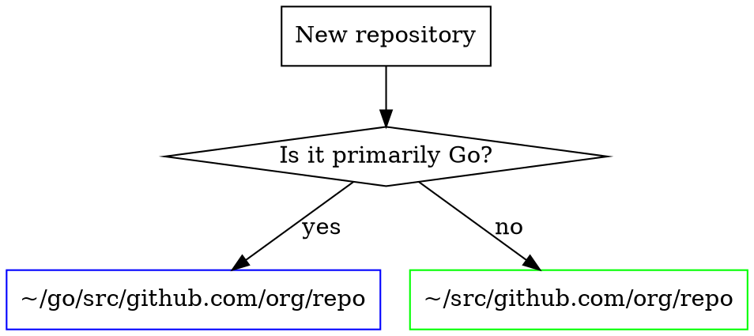

# Git Repository Organizer

Organize git repositories by language following GOPATH conventions for Go and `~/src/` for everything else.

## Repository Placement



| Project Type | Location |
|--------------|----------|
| Go projects | `~/go/src/github.com/org/repo` |
| Python, JS, Rust, etc. | `~/src/github.com/org/repo` |
| Mixed (primarily Go) | `~/go/src/...` |
| Mixed (other primary) | `~/src/...` |

## Detecting Go Projects

```bash
# Check for Go indicators
test -f go.mod && echo "Go project"
find . -maxdepth 2 -name "*.go" | head -1
```

**Quick inspection before cloning:**
```bash
git clone git@github.com:org/repo.git /tmp/repo-check
cd /tmp/repo-check
if [ -f "go.mod" ] || [ -n "$(find . -maxdepth 2 -name '*.go')" ]; then
    echo "Go → ~/go/src/github.com/org/repo"
else
    echo "Other → ~/src/github.com/org/repo"
fi
rm -rf /tmp/repo-check
```

## Cloning Commands

**Go projects:**
```bash
mkdir -p ~/go/src/github.com/org
cd ~/go/src/github.com/org
git clone git@github.com:org/repo.git
```

**Non-Go projects:**
```bash
mkdir -p ~/src/github.com/org
cd ~/src/github.com/org
git clone git@github.com:org/repo.git
```

## Repository Audit

**Find all repositories:**
```bash
find ~/go/src -name ".git" -type d -maxdepth 5
find ~/src -name ".git" -type d -maxdepth 3
```

**Find misplaced Go projects in ~/src:**
```bash
for dir in ~/src/*; do
    [ -f "$dir/go.mod" ] && echo "Misplaced Go: $dir"
done
```

**Check for uncommitted changes:**
```bash
for dir in ~/go/src/github.com/*/*; do
    [ -d "$dir/.git" ] && cd "$dir" && \
    ! git diff-index --quiet HEAD -- 2>/dev/null && \
    echo "Uncommitted: $dir"
done
```

## Reorganizing Misplaced Repos

1. **Identify** - Find repos in wrong location
2. **Extract remote** - `git remote -v` to get org/repo
3. **Move** - `mv ~/src/project ~/go/src/github.com/org/repo`
4. **Update references** - IDE workspaces, aliases, symlinks
5. **Verify** - `cd new/path && go build` (for Go projects)

## Quick Reference

| Task | Command |
|------|---------|
| Clone Go project | `mkdir -p ~/go/src/github.com/org && cd $_ && git clone ...` |
| Clone other project | `mkdir -p ~/src/github.com/org && cd $_ && git clone ...` |
| Find all repos | `find ~/go/src ~/src -name ".git" -type d` |
| Check if Go | `test -f go.mod` |
