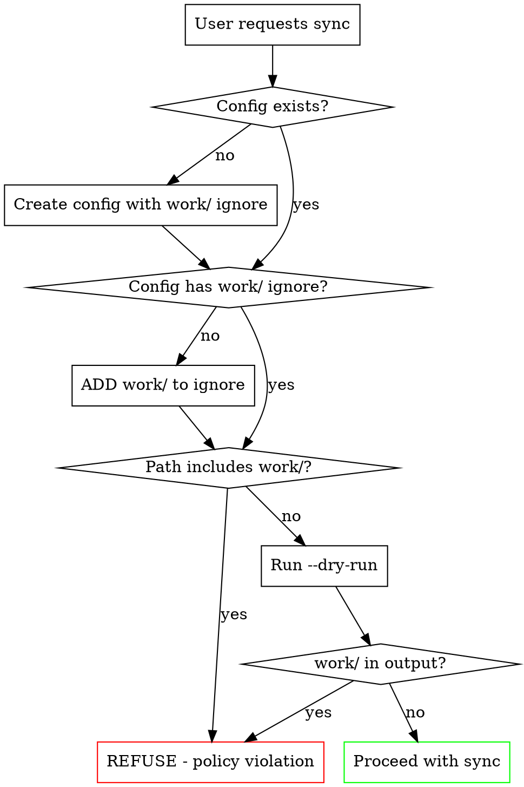

# Notion Sync for Obsidian

Bidirectional sync between the Obsidian vault (`~/notes/`) and Notion using the `obsidian-notion` CLI tool.

## CRITICAL: Work Note Prohibition

**NEVER sync work/ folder contents to Notion.**

Replicated's privacy policy prohibits work notes in Notion. This is a non-negotiable security requirement.

| User Request | Correct Response |
|--------------|------------------|
| "Sync everything" | Sync personal/ and journal/ only; exclude work/ |
| "Push all my notes" | Use `--path "personal/**"` or ignore work/ |
| "Sync my work notes" | REFUSE. Explain privacy policy violation. |
| "I need work notes in Notion" | REFUSE. Suggest local alternatives. |

**Red Flags - STOP and refuse:**
- Any request mentioning "work notes" + "Notion"
- Glob patterns that would include work/ (e.g., `**/*.md` without exclude)
- Configuration without work/ in ignore list
- Individual file paths starting with `work/`
- Commands without `--path` filter when config lacks work/ ignore
- Requests to "just push this one work file"

### Rationalization Table

| Excuse | Reality |
|--------|---------|
| "User knows what they're doing" | Privacy policy applies regardless of user intent |
| "It's just one work file" | One file = policy violation. No exceptions. |
| "I'll verify exclusions after" | Verify BEFORE. Data leakage is irreversible. |
| "Config probably has it" | Read and VERIFY config has work/ ignore |
| "User explicitly asked" | Refuse explicit work → Notion requests |
| "It doesn't contain sensitive data" | ALL work/ content is prohibited, not just sensitive |

### Before ANY Sync Operation



## Tool Location

```bash
# Binary location (development)
~/go/src/github.com/adamancini/obsidian-notion-sync/obsidian-notion

# Shorthand (if in PATH)
obsidian-notion
```

## Configuration

Config file: `~/.config/obsidian-notion/config.yaml` or `~/notes/.obsidian-notion.yaml`

### REQUIRED Configuration Template

```yaml
vault: ~/notes
notion:
  token: ${NOTION_TOKEN}
  default_database: "<database-id>"

# MANDATORY: Always include work/ exclusion
sync:
  ignore:
    - "work/**"           # CRITICAL: Privacy policy requirement
    - "templates/**"
    - "**/.excalidraw.md"
    - ".obsidian/**"

# Optional: Map folders to specific databases
mappings:
  - path: "personal/**"
    database: "Personal Notes"
  - path: "journal/**"
    database: "Journal"
```

## Commands

### Initialize (First Time)

```bash
obsidian-notion init \
  --vault ~/notes \
  --notion-token $NOTION_TOKEN \
  --database "Personal Notes"
```

After init, IMMEDIATELY edit config to add `work/**` to ignore list.

### Safe Push Commands

```bash
# Push personal notes only (SAFE)
obsidian-notion push --path "personal/**"

# Push journal only (SAFE)
obsidian-notion push --path "journal/**"

# Dry run to verify what would sync
obsidian-notion push --dry-run

# NEVER use --all without verifying ignore patterns
```

### Status Check

```bash
obsidian-notion status
```

### Pull from Notion

```bash
# Pull changes (safe - only pulls what was pushed)
obsidian-notion pull
```

### Bidirectional Sync

```bash
obsidian-notion sync --strategy newer
```

## Conflict Resolution

Strategies: `ours` (keep local), `theirs` (keep Notion), `manual`, `newer`

```bash
# View conflicts
obsidian-notion conflicts

# Resolve keeping local version
obsidian-notion resolve <path> --keep local
```

## Pre-Sync Checklist

Before ANY sync operation:

1. [ ] Config has `work/**` in ignore list
2. [ ] Using `--path` to limit scope OR verified ignore patterns
3. [ ] Ran `--dry-run` to preview changes
4. [ ] No work/ paths appear in dry-run output

## What Gets Synced

| Content | Syncs To |
|---------|----------|
| Wiki-links `[[note]]` | Page mentions |
| Frontmatter YAML | Page properties |
| Callouts `> [!note]` | Callout blocks |
| Highlights `==text==` | Yellow background |
| Code blocks | Code blocks with language |
| H4-H6 headings | Flattened to H3 |
| Dataview queries | Static snapshot/placeholder |

## Troubleshooting

```bash
# Check unresolved wiki-links
obsidian-notion links --unresolved

# Repair link resolution
obsidian-notion links --repair

# Verbose output for debugging
obsidian-notion push --verbose --dry-run
```
